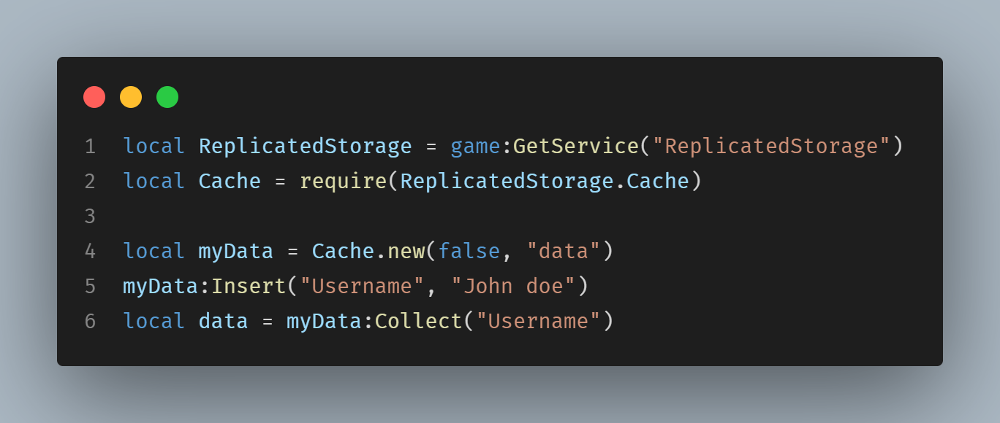

# The Cache modulescript

Save and access your game data quickly!

## Code example

 

# Downloads

> Download it [here](https://github.com/zirou32/Cache/releases/tag/cache-releases) for ROJO and Roblox Studio
>
> Get it from the Roblox catalog [here](https://www.roblox.com/library/12994813734/Cache)

_a useless modulescript :D_
